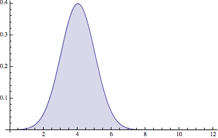
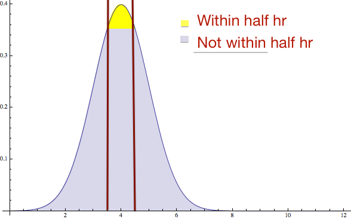
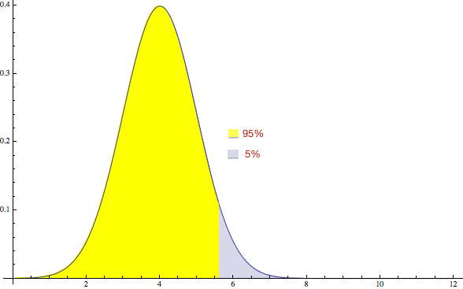
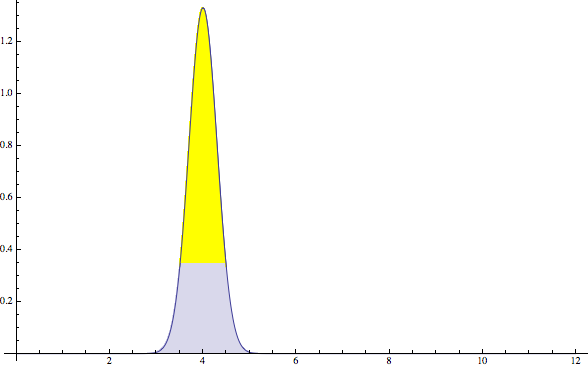

# So you want to know how long implementing a feature takes?

After we implemented the feature, it's easy to know how long it took.  The answer is a number, like 3.5 hours:

<table>
    <tr>
        <td>Time elapsed</td>
        <td>3.5 hours</td>
    </tr>
</table>

Numbers are simple.  For example, what's the minimum amount of time this feature could take?  3.5 hours.  The maximum?  3.5 hours.  The average? 3.5 hours.

However, *before we have implemented the feature*, the answer isn't a number, but a probability.  And a probability might give 3 different results for each of those questions.  

We can draw probabilities as a chart, and mathematicians call this kind of chart a PDF.

The way you can read this chart is "It probably takes 4 hours", because there's a big hump around x = 4.  But notice that it could be 2 hours, or 6 hours.  

In fact, the chance that it is within half an hour of 4 hours is actually pretty small:

In fact when you run the math you discover that **only 38% of the time will you be within half an hour of 4.**  So saying "It's probably 4" is not a good way to read this chart, even though that's the **best single number** that can describe the probability.

# An impedence mismatch

The problem is that when a manager asks "how long will this take" they want a number to put in their spreadsheet that they can add with other numbers.  But there *is no such number*.  There's only a probability.

What an engineer probably does is they make a chart like this (maybe in their mind) and notice it has a hump at 4.  And so they say "eh... probably 4".  But what they don't say is "There's a 60% chance that it's not very close to 4".

# Working in ranges

One way to solve this problem is to work in a range.  For example, there's a 95% chance the answer is between 2 and 6:

The problem is when you tell the manager "It's a number between 2 and 6" they still need a number to put in the spreadsheet.  So they will take the average of 2 and 6, and get 4.  Now we are back where we started again.

# Working in confidence intervals

Another way to do this is to pick a number such that the chance of running over is low.  For example, if you pick 5.6 hours, there's only a 5% chance of going above it:

This actually works pretty well if you have a stupid manager.  The problem is if you have a smart manager, he will actually try to understand your estimate, and will ask a question like "Why do you think it is 5.6 hours?" to which the answer is "I don't really think it's 5.6 hours, I think it's 4 hours."  Now the manager will look at you funny, and we are back where we started again.

By the way, this is where all the rules about "multiply estimates by 3" really come from.  They aren't just something bad estimators do, they are a way to convert between "how long you think it will take" and "pick a number that it won't exceed" which are two different things when we are talking about a probability.

# Get a narrower hump

If you are smart you may have noticed that this problem is because of the width of the hump.  If we had a narrow hump, there is a higher chance of being close to 4:

The problem is that the width of the hump is "uncertainty".  And it is hard to be certain about much in software.

Software development is really doing things that have never been done exactly that way before.  (If it is exactly like a time before we can just take the code from before, we don't have to do any software development.)  So to a large extent the width of the hump cannot be made any smaller.

One way to make it smaller is to start actually working on the feature.  Because once you feel you are about halfway through the feature, you are a lot more certain about it than you were before you started.  And there are times when this is a good strategy.  But usually it only makes sense if you can get a lot of certainty in a short amount of time, by quickly testing an important idea, for example.  It isn't practical in general.

# Probabilities, not numbers

Really the answer is that **there is no shortcut to working in probabilities** instead of numbers.  There is just **no way to boil a probability down to a single number that can be used in a spreadsheet to stand in for how long the feature takes**.  Probabilities and numbers are different, and no amount of wishing things were different makes a number-based estimate accurate.

The problem with *that* is that doing math to add probabilities is a lot harder than adding numbers.  Everybody knows how to add numbers; to know how to add probabilities you need a degree in mathematics. Really only mathematicians understand how "probably 4 hours" from an engineer turns into "5.6 hours" on the estimate.  And things get a lot weirder when it comes time to add probabilities together, and two 2-hour tasks no longer take 4 hours.

One of the things I'm working on are software estimating tools that know how to do math on probabilities so ordinary managers can do it.  But until somebody solves that problem you have several bad choices: either get a mathematician to do your estimates, or accept that your number-based estimates are off by a lot, or swear off estimates altogether.  I know great software organizations that do all 3.  What you can't do is pretend that you can get an accurate number for how long something will take, because you will surely fail.