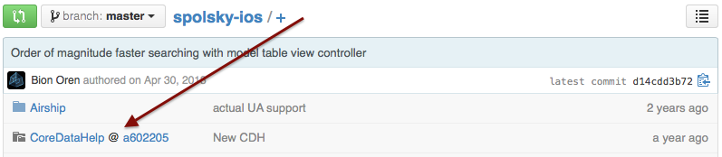
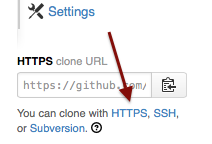

You have come here because you are trying to use a project that uses [git submodules](http://www.git-scm.com/book/en/Git-Tools-Submodules).  You can identify a submodule because on GitHub it looks like this:



A submodule is just a pointer to another repository: it does not include any code, it simply tells your git client where you can go get it.  Because it is just a pointer, you have to take some special steps to turn the pointer into the real code it points to.

# Should I use submodules?

Submodules are a good choice when you want a **strong separation** between one project and another.  For example, you may have a library, and many applications that use it.  In such a circumstance submodules are warranted.

On the other hand you may have a library that is only used by one application.  Or you may have a library where we intend to use it in other applications someday but for the time being it will support only one project.  In such a case submodules may be heavyhanded; you may want to put the library just in a folder in your main repository.

## Should I use subtrees instead?

Some people, [including the git book](http://git-scm.com/book/ch6-7.html), advocate subtrees as a better kind of submodule.  I don't think this is true most of the time.

The advantage of subtrees is that everything is in one repository, which means things like "John accidentally forgot to push a submodule" cannot happen.

However the disadvantage of subtrees is that having everything in one repository makes it easy to modify everything in one commit.  That is fine as far as it goes, but when it comes time to push only subtreeA somewhere, we have to create a bunch of new commit objects to store only the part of the commit that involves subtreeA.  Then subtreeA gets pulled down into a new project and intermixes with that project's commits, and the same thing happens again.  This creates a combinatorial explosion in commits, and it is easy to get yourself into some kind of merge failure involving strange duplicate commits or messages from unrelated projects that is difficult to reason about.

For this reason I think the discipline that comes with submodules is good.  If you find yourself being annoyed by the work of making two commits, it may be that the project and the subproject are not so separated after all.  Perhaps you want not a subtree, but just a folder with some files in it in your main repository.

# Downloading projects that use submodules

## Command-line git

After you clone your repository, run these lines in the repository directory:

```bash
git submodule update --init --recursive
git submodule update --recursive
```

These lines will instruct git to go fetch all the submodules for the given project, including all submodules for the submodules.

### Common errors and how to fix them

#### Permission denied (publickey)

You may see an error like this:

```
Cloning into core...
Permission denied (publickey).
fatal: The remote end hung up unexpectedly
Clone of 'git@github.com:ProdigyView/ProdigyView-Core.git' into submodule path 'core' failed
```

This means what *while you have permission to access the root repository*, you don't have permission to fetch one of the **submodules**.

##### If the submodule is open-source

If the submodule is open-source, you need to change the pointer in the root repository to use a *public* URL.  

First, you locate the `.gitmodules` file.  You will see an entry like this:

```
[submodule "CoreDataHelp"]
        path = CoreDataHelp
        url = git@github.com:drewcrawford/CoreDataHelp.git
```

The url should be changed to a *public* URL.  A public URL looks like this: `https://github.com/drewcrawford/CoreDataHelp.git`.  You can find your public URL by visiting the repository on GitHub.com, scrolling down to the "clone URL", and choosing HTTPS.



After changing the URL in the .gitmodules file, you run this command:

```
git submodule sync
```

The original "git submodule update" lines should now succeed.

Commit and push the new .gitmodules file to the repository, and instruct other team members to run `git submodule sync` for the .gitmodule changes to take effect.

##### If the submodule isn't open-source

If the submodule isn't open-source, it's possible that you don't have permission to pull it.  Contact your organization admin to get pull permission to the submodule's repository.

### fatal: reference isn't a tree

You may see an error like this:

```
fatal: reference isn’t a tree: 6c5e70b984a60b3cecd395edd5b48a7575bf58e0
Unable to checkout '6c5e70b984a60b3cecd395edd5ba7575bf58e0' in submodule path 'rack'
```

Recall that submodules are just pointers.  This error occurs when the code the pointer refers to can't be found.  Generally this happens because whoever worked on this last failed to push their code to the server, so it only exists on their computer.  If it only exists on their computer, your computer can't find it.

To fix this problem, first find out who is responsible:

```bash
git log -1 rack
commit 85a3eee996800fcfa91e2119372dd4172bf76678
Author: Drew Crawford <drew@sealedabstract.com>
```

In this case, Drew is responsible.  E-mail him this page, and tell him to look at the "Making commits" section below.

### Sourcetree

Sourcetree is known to handle submodule downloads correctly, but you can still run into the errors described under "command-line git".  Sourcetree has a "Terminal" button that lets you enter commands at the command-line to follow the resolution steps documented here.

### Downloading zip files

GitHub has a button to download a repository as a zip file:


Unfortunately this button doesn't understand submodules--you will get an empty folder where the submodule contents should go.  This creates the illusion that files are missing from the repository when they're just in a submodule.

You should use a real git client instead of this button.

### Other git clients

I don't know how other git clients handle submodules.  Consider using one of the methods known to work on this page.

# Working on (comitting to) projects that have submodules

If you don't edit the submodules, you don't have to do anything special.  Just use git as you normally do.  The problem comes when you want to make changes in the submodules.

Changing a submodule is a 2-phase process.  First you update the submodule, then you update the main project to point to the changes that you made.

## Changing the submodule

### Detached head

By default, submodules operate in a **detached head** state.  This means you're not on any particular branch. This is probably not what you want.  Let's find out:

```bash
$ cd my_submodule
my_submodule$ git status
# HEAD detached at d7269b1
```

To fix this, we'll switch onto master:

```bash
my_submodule$ git checkout master
Switched to branch 'master'
```

If we had some commits already made while in the detached head state, they are *dangling*.  Let's go get them:

```bash
my_submodule$ git merge d7269b1
Updating d7269b1..3a0874c
Fast-forward
 README | 1 -
 1 file changed, 1 deletion(-)
```

whew!

### Making commits

Now make your changes as you normally would, for example in an IDE or a text editor.

Next, *in the submodule itself*, you make a commit.

```bash
my_submodule$ git commit -a -m "Changing foo"
```

Now, you push the changes.  **If you don't do this, people will get the 'fatal: reference isn't a tree' error described above**.

```bash
my_submodule$ git push
Counting objects: 25, done.
Delta compression using up to 2 threads.
Compressing objects: 100% (25/25), done.
Writing objects: 100% (25/25), 2.43 KiB, done.
Total 25 (delta 4), reused 0 (delta 0)
To git@github.com:drewcrawford/my_submodule.git
 * [new branch]      master -> master
 ```

 If instead you see

 ```bash
 my_submodule$ git push
 Everything up-to-date
 ```

 **that may be an error**, particularly if you are using a version of git prior to 2.0.  Version 2.0 is more explicit about this being an error:

 ```bash
 my_submodule$ git push
fatal: You are not currently on a branch.
To push the history leading to the current (detached HEAD)
state now, use

    git push origin HEAD:<name-of-remote-branch>
```

This error is caused by being in a detached head state.  To fix this see the section on detached head above.

## Updating the parent repository

### Getting changes into the submodule folder itself

If you've made, committed, and pushed changes while inside the my_submodule folder itself, then it already has those changes.

However, maybe somebody else updated the submodule repository on GitHub and you want to update to the new version.  In that case, let's pull their changes.  First, cd into the submodule directory itself and verify you are not in detached head state.  See the section on **Detached head** to verify this.

Now pull their changes:

```bash
git pull
```

### Updating the parent repository

After you have committed to the submodule, and pushed it somewhere, and the changes are in your local submodule folder, you need to update the parent repository to point to the updated version of the submodule.  Otherwise it will keep pointing to the old version.

First let's check `git status`.  Here's how it's supposed to look:

```bash
$ git status
# On branch master
# Changed but not updated:
#   (use "git add <file>..." to update what will be committed)
#   (use "git checkout -- <file>..." to discard changes in working directory)
#   (commit or discard the untracked or modified content in submodules)
#
#   modified:   my_submodule (new commits)
#
no changes added to commit (use "git add" and/or "git commit -a")
```

If instead of `new commits` you see the strings `modified content` or `untracked content` it means that you have forgotten to commit some things in the submodule.  Go back and read the section on **Making commits**.

Now we will make a commit in the parent project:

```bash
$ git commit -a -m "Updating my_submodule1 pointer"
$ git push
```

And we're done.  Our parent project now uses the new version of the submodule.


