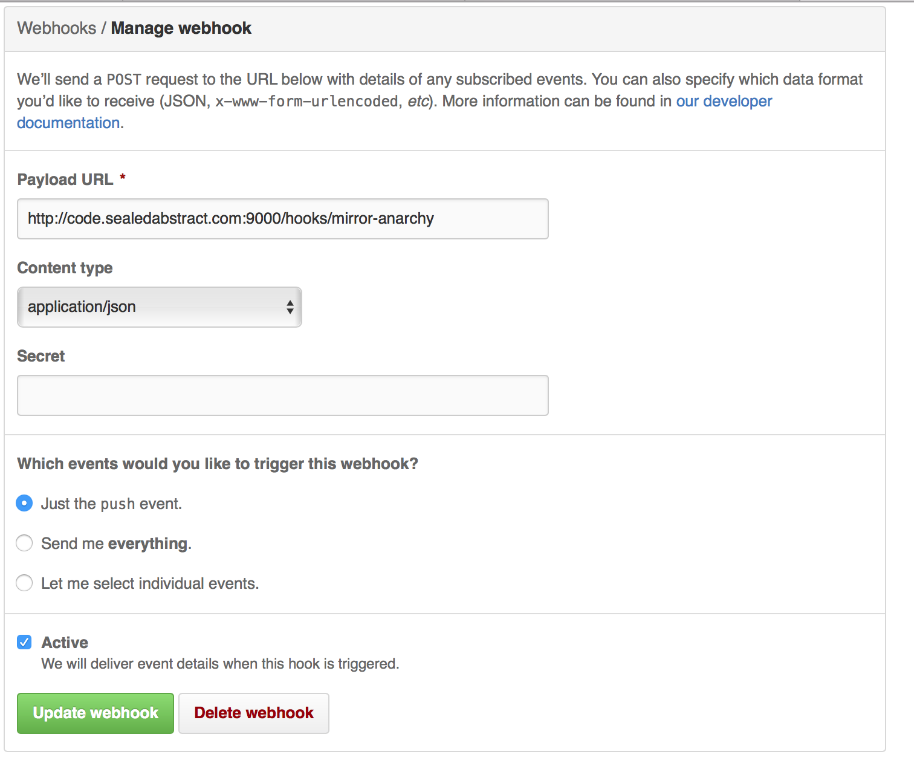
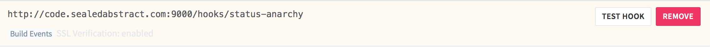

So you run a project on GitHub (actually *on* GitHub) and you want to mirror it to your local GitLab install.

Here we

1.  Mirror to GitLab
2.  Send status updates back

1.  First, create a system user: gitmirror
2.  Second, create a gitlab user: gitmirror
3.  Install [github2gitlab](https://pypi.python.org/pypi/github2gitlab) from pip
4.  Create a `/home/gitmirror/sync-project.sh` with
    
    ```bash
    #!/bin/bash
    /usr/local/bin/github2gitlab --gitlab-url https://code.sealedabstract.com --gitlab-token 'YOURTOKEN' --github-repo AnarchyTools/atbuild --gitlab-repo AnarchyTools/atbuild
    ```
5.  Install [webhook](https://github.com/adnanh/webhook)
6.  I use this for /etc/init.d/webhook.  I made it via https://gist.github.com/naholyr/4275302/
    
    ```bash
    #!/bin/sh
    ### BEGIN INIT INFO
    # Provides:          webhooks
    # Required-Start:    $local_fs $network $named $time $syslog
    # Required-Stop:     $local_fs $network $named $time $syslog
    # Default-Start:     2 3 4 5
    # Default-Stop:      0 1 6
    # Description:       Webhooks\ daemon
    ### END INIT INFO

    SCRIPT="/usr/local/bin/webhook -hooks /etc/hooks.json --verbose=true"
    RUNAS=gitmirror

    PIDFILE=/var/run/webhooks.pid
    LOGFILE=/var/log/webhooks.log

    start() {
      if [ -f /var/run/$PIDNAME ] && kill -0 $(cat /var/run/$PIDNAME); then
        echo 'Service already running' >&2
        return 1
      fi
      echo 'Starting service…' >&2
      local CMD="$SCRIPT &> \"$LOGFILE\" & echo \$!"
      su -c "$CMD" $RUNAS > "$PIDFILE"
      echo 'Service started' >&2
    }

    stop() {
      if [ ! -f "$PIDFILE" ] || ! kill -0 $(cat "$PIDFILE"); then
        echo 'Service not running' >&2
        return 1
      fi
      echo 'Stopping service…' >&2
      kill -15 $(cat "$PIDFILE") && rm -f "$PIDFILE"
      echo 'Service stopped' >&2
    }

    uninstall() {
      echo -n "Are you really sure you want to uninstall this service? That cannot be undone. [yes|No] "
      local SURE
      read SURE
      if [ "$SURE" = "yes" ]; then
        stop
        rm -f "$PIDFILE"
        echo "Notice: log file is not be removed: '$LOGFILE'" >&2
        update-rc.d -f webhooks remove
        rm -fv "$0"
      fi
    }

    case "$1" in
      start)
        start
        ;;
      stop)
        stop
        ;;
      uninstall)
        uninstall
        ;;
      retart)
        stop
        start
        ;;
      *)
        echo "Usage: $0 {start|stop|restart|uninstall}"
    esac
    ```
7.  `update-rc.d webhooks defaults`
8.  Now we need our `/etc/hooks.json`:
    
    ```json
    [
      {
        "id": "mirror-anarchy",
        "execute-command": "/home/gitmirror/sync-anarchy.sh",
        "command-working-directory": "/home/gitmirror"
      },
      {
        "id":"status-anarchy",
        "execute-command":"/home/gitmirror/status-anarchy.sh",
        "command-working-directory": "/home/gitmirror",
        "pass-arguments-to-command": [
            {"source": "payload", "name": "build_status"},
            {"source": "payload", "name": "build_id"},
            {"source": "payload", "name": "sha"},
            {"source": "payload", "name": "build_name"}
        ]
      }
    ]
```
9.  (Remember to let 9000 through your firewall)
10.  You *may* need to change /home/gitmirror/{repo}'s remote to use an SSH url to avoid an authentication prompt.  Try it and see.
10.  Now we need that second script, `status-project.sh`:

    ```bash
    #!/bin/bash
    set -e
    GITLAB_STATE="$1"
    BUILDNO="$2"
    SHA="$3"
    NAME="$4"

    GITLAB_PROJECT="AnarchyTools/atbuild"
    GITHUB_PROJECT=$GITLAB_PROJECT
    GITLAB_URL="https://code.sealedabstract.com/"

    BUILD_URL=${GITLAB_URL}${GITLAB_PROJECT}/builds/${BUILDNO}

    #calculate github state
    if [ "$GITLAB_STATE" = "running" ]; then
            GITHUB_STATE="pending"
    elif [ "$GITLAB_STATE" = "success" ]; then
            GITHUB_STATE="success"
    elif [ "$GITLAB_STATE" = "failed" ]; then
            GITHUB_STATE="failure"
    else
            echo "unknown gitlab state $GITLAB_STATE"
            exit 1
    fi

    PAYLOAD="{\"state\":\"${GITHUB_STATE}\",\"target_url\":\"${BUILD_URL}\",\"context\":\"$NAME\"}"
    curl -d "$PAYLOAD" -u glados:YOURTOKENHERE https://api.github.com/repos/${GITHUB_PROJECT}/statuses/${SHA}
    ```
    
11.  This assumes [glados](https://github.com/glados) is your GitHub user.
12.  Finally, we config the webhooks themselves:
    
    

