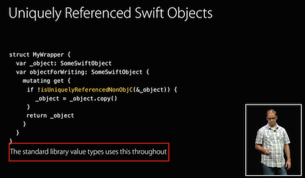

Swift has rich value types, which is a new experience for many software developers.  This has opened the door for the functionalists to ride in.

What I call "functionalism" is really the philosophy of [functional programming](https://en.wikipedia.org/wiki/Functional_programming), which is in fact a very old idea.  The idea is that a lot of bugs in programming today are due to having the wrong *state*.  For example, the Heartbleed bug happened because someone re-used the same array for a different purpose.  So the solution, clearly, is to get rid of mutable arrays, and mutable variables, and the assignment operator, and you can't have the heartbleed bug *now*.  (Why they did not also get rid of the programmer is an exercise left to the reader.)

As you can tell by the tone of this essay I am not a functionalist, although in the interests of fairness I will defend them on two points before I tear into them.  The first is that there are, legitimately, moments where *state* does more harm than good.  There are even moments like that on most software projects.  If you have a problem that feels very mathematical, then it can often be represented in a functional paradigm very well.

The second point of defense is that this whole scheme works a lot better than you might expect.  The way they write functional programs for decidedly non-functional problems is through a trick called a monad, which I will not explain and nobody understands anyway, but the point is, in the hands of a very clever programmer, functional programming "can" be used in many more places than you would naively expect.

And that is really the problem.  It works at first and then it keeps working until suddenly it doesn't.  And this ~~communism~~ functionalism spreads ideologically until your ~~country~~ codebase is saddled with debt and nobody can bail you out because you have a lot of monads and nobody can understand them.

But this is not a rant about functional programming; this is a rant about Swift.

# Swift value types

Swift has rich value types, which operates like a light that draws the functionalists and functionalist-sympathizers towards it.  Who are all wondering if, perhaps, this turn of events means their weekends poking around in Haskell are now at last commercially relevant.

The problem, like all problems in programming, is figuring out which tool is right for which job.  Programming is a discipline prone to cargo-cult thinking, which is why your company religiously performs the Agile Scrum magic spell and yet somehow the project is still late.  So it turns out there's no magic trick that makes all programs better.

The trouble is that Swift is a young language and we don't have a good intuition about if tool X is a good fit for the problem or not because Tool X was announced 1 year ago and most people are doing Swift part-time right now.

This leads to vaguely positive statements like [Andy Matuschak](http://www.objc.io/issues/16-swift/swift-classes-vs-structs/)'s in which he is "emphatically not suggesting that we build everything out of inert values" and yet we should "Think of objects as a thin, imperative layer" which presumably leaves a thick layer of values for everything else, and "As you make more code inert, your system will become easier to test and change over time" which is vaguely true but when taken to its logical conclusion seems to contradict his earlier statement that "not everything" should be a struct.

Meanwhile some other, less-pessimistic people actually *have* run this out to its logical conclusion.  And that produces results like [the top SO answer](http://stackoverflow.com/a/24232845)

> My personal advice, which contradicts Apple's, is to always default to using a Struct because they greatly reduce complexity and fallback to Classes if the Struct becomes very large or requires inheritance.

and

> the whole point of this writeup is that struct should be chosen by default and class should only be used when necessary. Structs are much safer and bug free, especially in a multithreaded environment. Yes, you can always use a class in place of a struct, but structs are preferable.

[and](https://twitter.com/tacticalgrace/status/474201139286536193)

> Dear newly minted Swift devs, try to use... also struct & enum instead of class.

[and](http://joelperry.net/mac-os-x/swift-classes-vs-structs-youre-doing-it-wrong/)

> I’m not saying that classes don’t have a place in Swift (they absolutely do), but they will not be the first tool I reach for.

[and](http://ericasadun.com/2015/05/05/swift-dont-do-that/)

> Don’t use classes when structs will do. Use classes if you want reference types. Use structs if you want value types. You can add functionality to both (and to enumerations) in Swift. When in doubt, err on the side of value types. If your construct doesn’t have a life cycle, or two constructs with similar values should be considered as the same thing, use a struct. (Do take advantage of Swift structs. They’re neat.)


[and](http://sportngin.github.io/styleguide/swift.html)

> Unless you require functionality that can only be provided by a class (like identity or deinitializers), implement a struct instead... Rationale: Value types are simpler, easier to reason about, and behave as expected with the let keyword.

I call these choose-structs views the Structs Philosophy™.

I'm not saying these people are on crack, but they have been swindled by the ~~communist~~ funtionalist lobby.  A lobby that wants you to believe that one weird trick will make your codebase better, replacing the cargo-cult Agile practices with equivalently useless cargo-cult functionalist practices.


Meanwhile, I have been working in Swift practically full-time since it was released, and have built entire projects in several different Swift programming paradigms.  I will first develop what is wrong with the Structs Philosophy™ and then I will present a totally different paradigm that leverages structs where they work in real life and not where they don't.

# Against the Structs Philosophy™

## Ground rules

First, we will consider as our object of study a project that has no legacy dependencies.  That is, it's Swift "all the way down".  This excludes a whole category of problems of the form "You wanted to use structs but you needed to implement `MFMailComposeViewControllerDelegate` so you can't."

Second, I want to consider a project that is arbitrarily large.  Obviously, because arbitrarily small programs are boring.  But really, because arbitrarily large projects are guaranteed to have all the problems that it is possible to have within the language features that we allow ourselves.

## Zawinsky's law

Zawinski's Law of Software Envelopment states that

> Every program attempts to expand until it can read mail. Those programs which cannot so expand are replaced by ones which can.

Since our program is arbitrarily large, it follows that it can send mail.  (The proof is straightforward: if it doesn't, then there exists some larger program that sends mail, and then our program is not arbitrarily large.)

Of course, our program can not only send mail, but it can send HTTP requests, and send birthday presents, and any number of other things.  Naturally, we encode this behavior with a protocol.

```swift
protocol CanSend {
    typealias Message
    func send(messgage: Message) throws
}
```

Now we can implement this protocol with our NetworkSender, our BirthdayPresentSender, and so on.  And these are all implemented with Structs because we follow the Struct Philosophy™

Now our program, naturally, has unit tests, (because it is arbitrarily large).  And so we have a MockSender somewhere that we use as a mock for our tests.

```swift
struct MockSender<T> {
    var sentMessages: [T] = [] //you inspect this property to study 
    //what messages were previously sent for unit test purposes
}
```

We can of course implement our CanSend protocol for our MockSender: 

```swift
extension MockSender : CanSend {
    typealias Message = T
    func send(message: T) {
        self.sentMessages.append(message) //error: Immutable value 
        //of type '[T]' only has mutating members named append
    }
}
```

Well *obviously*.  We just have to make `send` a mutating function.

### A brief interlude about mutating functions

Now if you are not intimately familiar with Swift semantics I should probably explain what mutating functions are.  They are perhaps poorly named.

What they really do *logically* is they generate a completely new version of the struct and assign the caller's reference to this new version.  This becomes clear if you read the Swift book:

> “The [mutating function] can also assign a completely new instance to its implicit self property, and this new instance will replace the existing one when the method ends.”

This means that

```swift
var myInt = MyInt(2)
myInt.mutatingIncrement()
```

is really semantic sugar for

```swift
var myInt = MyInt(2)
myInt = MyInt(myInt.value + 1)
```

and not

```swift
let myInt = MyInt(2)
myInt.value++
```

so there is not really a mutation here so much as the *illusion* of one.  But anyway

## Back to our regularly scheduled struct-bashing

With mutating funcs, we get

```swift
extension MockSender : CanSend { //Type MockSender<T> 
               //does not conform to protocol CanSend
    typealias Message = T
    mutating func send(message: T) {
        self.sentMessages.append(message) //note: candidate 
        //is marked 'mutating' but protocol does not allow it
    }
}
```

Right, so the problem is our protocol says the function is non-mutating, but in reality it needs to be mutating.

So we go change the protocol, right?  I mean after all, *by definition* this program has no legacy code, so we can structure the protocol however we want.

**Wrong wrong wrong**.

First off, 90%+ of the types that implement `canSend` can be side-effect-free, at least at their own level of abstraction.  When you call posix `sendmsg` for example, you don't need to record that fact anywhere.  When you call `write` you don't update any state.  Deep down in your kernel, sure, there is some mutable state.  But if your implementation of `CanSend` consists of passing the message onto somebody else to deal with, you can implement that fine as a non-mutating `func`.  In fact the Struct Philosophy says you *should*.  It wants you to *prefer immutable state*.

It's that last 10% of the time that's a problem though.  Here we have a mock that needs to track what messages it's been sent, and that requires mutating state.  

(You might imagine "that's just a unit testing artifact" but now consider the case of passing messages *within* our program, which would require us to maintain an internal queue in the live application.  We know our program has such a message passing system, because it's arbitrarily large.  So this problem is not an artifact of unit testing.)

We can solve this problem with a device called an "inner class", which you probably have already seen, but if you haven't just imagine that there is some god-awful way to create a mutating implementation of a non-mutating func, and we will cover the details later.

## Wherein the philosophy goes off the rails

Now we can do more than simply send messages.  We have arbitrarily large protocols in our arbitrarily large program.

As we've established, most types (say, 90%) can implement funcs in a non-mutating way.  But to quote another Zawinski law, "Everybody uses a different 10%".

```swift
protocol Foo {
    func bar1() //there exists some type that wants 
                //this func to be mutating
    func bar2() //and another type that wants this one to be mutating
    func bar3() //and this one
    func bar4() //etc.
    //...
}
```

Similarly, **for every type that is sufficiently large, it conforms to some non-mutating protocol with a mutating implementation.**

Or, to put this in code

```swift
struct Bar {
    func foo1() {} // one of these functions
    func foo2() {} // is secretly a mutating implementation
    func foo3() {} // for Bar of sufficient size
    // ...
    //etc.
}
```

Now.  How are we going to solve this problem?  Well, the mutating inner class.  And fun fact: we've used one already while you weren't paying attention.  I've just kept it out of view.

Recall that when we send a message via posix `sendmsg`, "way down in the kernel" somewhere, there is mutable state.  In other words, we have wrapped a mutating type in an immutable one. 


```swift
class PretendKernel {
    var kernelBuffer : [UInt8] = []
    func sendmsg(bytes: [UInt8]) {
        kernelBuffer.extend(bytes) //note that we can mutate
          //in a non-mutating function because PretendKernel
          //is a class, not a struct
    }
}


struct KernelSender : CanSend {
    var arbitrary: Int = 0
    typealias Message = [UInt8]
    var kernel = PretendKernel()
    
    func send(message: Message) throws { //we implement a 
        //"non-mutating" function by putting the mutating
        //work into the kernel
        kernel.sendmsg(message) 
    }
}
```

If you're anything like me, the above listing has a "code smell".  But the problem is, this isn't any different from the way we've done it earlier.  There's always been a kernel out there somewhere, that has a mutable buffer to store the messages.  The only difference is now instead of being "out there somewhere" it has a code listing that we see in front of us.

If there is a problem with this, then there must be the same problem in all the earlier examples.  If there is no problem with them, there can't be one here.  In any case we must be consistent.


Anyways, There is mutable state "out there somewhere" and we're just wrapping it in an 'immutable' container.  Is this really a struct though?  Because the move semantics are **weird**.

```swift
var a1 = KernelSender()
let a2 = a1 //is this move-by-value, or move-by-reference?
//make some changes to a1
a1.arbitrary = 2
try! a1.send([1,2,3])
//watch what hapened to a2
print("\(a2.kernel.kernelBuffer.count)") //3: moved by reference
print("\(a2.arbitrary)") //but this part moved by value
```


I claim that when we depart from the land of "pass-by-value" and even "pass-by-reference" into "pass-by-WTF", we have departed the land of the reasonable.  So something is very very wrong here.

Even the Swift engineers are with me on this one.  WWDC 2015 414 "Building better apps with value types in Swift"


Let me talk about what is *not* wrong.  It is *not* wrong to wrap a class in a struct.  [This is how Swift.Array works under the hood.](https://www.mikeash.com/pyblog/friday-qa-2015-04-17-lets-build-swiftarray.html)

Here's a WWDC slide verifying that they do, in fact, use classes-inside-structs "throughout" the standard library:



The difference is, A) they have been really clever about hiding the inner class, which involves a lot of code and neat tricks that you can learn more about in the WWDC session (e.g., this is an advanced topic, that you should not sprinkle liberally throughout your codebase where the muggles will see it) and B) there is nothing *fundamentally* classful about arrays.  Arrays are, from a certain point of view, a kind of *value*.  So it makes sense for them to be a *value type*.

Our `KernelSender` isn't like that though.  In reality our KernelSender wraps an underlying singleton--the kernel.  You don't have two kernels.  You can't copy a kernel.  A kernel isn't a value.  It's a machine.

The conclusion here is that anything that wraps (read: **calls**) the kernel really shouldn't be a struct.  The implication being that you should not write structs that do:

* File I/O
* Networking
* Message passing
* Heap memory allocation
* etc.

But if you consider what we're really saying, we're really saying you shouldn't wrap not just the kernel, but any singleton.  Any singleton that you try and mess with from a struct will have this issue, becuase the references to those singletons don't get copied.  So we can add to the list of things you shouldn't do with structs:

* Location stuff (you have 1 GPS)
* Screen-drawing stuff (you have 1 display)
* Stuff that talks to UIApplication.sharedApplication()
* etc.

So what's left?  What's left is the classic value type stuff.  "Bag of ints"  `CGRect`.  Stuff that is pure data.  The "leaf nodes" of your object graph.  The "dumb models" in your MVC.

But when it comes time to actually save any of those models to disk, or push them over a network, or draw them to the screen, or whatever, you need a class.  Classes everywhere.  Not "immutable valuable types everywhere" like in the Struct Philosophy™


## And now for something completely different

Value types are often championed as applicable for "purely functional" problems (and they are certainly more applicable there than to the real-world problems we have studied so far).  

One commonly-proffered example of an applicable problem is the Sieve of Erosthenes, which can be elegantly expressed with immutable value types:

```swift
func sieve(numbers: [Int]) -> [Int] {

    if numbers.isEmpty { return [] }

    let p = numbers[0]

    return [p] + sieve(numbers[1..<numbers.count].filter { $0 % p > 0 })

}
```

Unfortunately this algorithm is *not* the Sieve of Erosthenes, not the least because the real Sieve is O(n*ln(ln(n))) and this algorithm is O(n^2) because we had to copy our array instead of mutating it, a result derived in [this paper](http://www.cs.hmc.edu/%7Eoneill/papers/Sieve-JFP.pdf).  The author concludes:

> The unfaithful-sieve algorithm does have a place as an example. It is very short, and it also serves as a good example of how elegance and simplicity can beguile us. Although the name The Unfaithful Sieve has a certain ring to it, given that the unfaithful algorithm is nearly a thousand times slower than our final version of the real thing to find about 5000 primes, we should perhaps call it The Sleight on Eratosthenes.

It turns out you actually can implement the Sieve of Erosthenes in a purely functional style, but it is a lot longer than the ordinary mutating one and it is so nonintuitive that apparently nobody in practice ever does it.

The moral of this story is that immutable, pure functional programming does not always work even in the *literal textbook examples*.  A mutating implementation of the Sieve is both simpler and faster, and far from helping, functional programming has actually *hindered* the exercise of writing fast, maintainable code.

By now you should be on your guard against anyone who promises one weird trick to a better codebase.

# An alternative hypothesis

I now present an alternative to the Structs Everywhere™ philosophy that I think is practical and resolves difficult cases, including all of the ones above, quickly and easily.

Imagine your coworker Jeff comes to you with the following question:

> Can we override the `==` operator on `Foo` so that 2 `Foo`s are equal if their elements match?

If your answer to this hypothetical question is "Of course", or "I thought that was already implemented", use a struct.  Note that CGRect et al, as well as your "dumb models" fit easily into these answers.

If your answer is anything else, use a class.  But *especially* these:

* Jeff, why the hell are you comparing two `NetworkController`s?  
* Why the hell do you even *have* two `NetworkController`s?
* What does it even *mean* to say that two HTTP responses are equal?  (Pause for existential reflection.)  That they have the same URL?  They have the same contents?  That one of them was once `.copy()`ed from another one?  I'm not sure that equality has a clear definition here.
* Are you trying to do this for `Foo` itself, or for everything `Foo` contains all 10 levels down?
* Let me get back to you after studying the class hierarchy.

All of those responses are hints that you don't want a value type after all, but a reference type.  Use a class.

I call this trick the "Jeff trick", since conversations with Jeff neatly resolve nearly every quandry I have about structs and classes.

## And now the official Apple guidance

Meanwhile, in the Swift Book, Chris Lattner has already ruled on when you should use classes and when you should use structs.  (As the most experienced Swift developer, he would know.)  I will now reproduce his guidance here, which I intersperse with commentary.  Notably, it's basically the Jeff Trick, but harder to read because he writes compilers for a living and is way smarter than any of us.

> As a general guideline, consider creating a structure when one or more of these conditions apply:

> * The structure’s primary purpose is to encapsulate a few relatively simple data values.

Note that this is trivially a case where you would tell Jeff to override `==`

> * It is reasonable to expect that the encapsulated values will be copied rather than referenced when you assign or pass around an instance of that structure.
> * Any properties stored by the structure are themselves value types, which would also be expected to be copied rather than referenced.

Here he is setting up those requirements that make equality-by-comparing-values sensible.  If your struct wraps a class instance (say, it wraps an `NSString`) then checking `if foo.nsString == bar.nsString` is not sensible, because `@"Foo" != @"Foo"`.

> * The structure does not need to inherit properties or behavior from another existing type.

This raises complicated questions about what it means for `Car` to be equal to `Bicycle`, which is yet another case where you would question Jeff's sanity.

The guidance then continues with 3 specific examples of good structs, all of which you would be happy to let Jeff define equality for:

> Examples of good candidates for structures include:

> * The size of a geometric shape, perhaps encapsulating a width property and a height property, both of type Double.
> * A way to refer to ranges within a series, perhaps encapsulating a start property and a length property, both of type Int.
> * A point in a 3D coordinate system, perhaps encapsulating x, y and z properties, each of type Double.

Finally, the official Apple guidance concludes with this dire warning:

> **In all other cases, define a class, and create instances of that class to be managed and passed by reference. In practice, this means that most custom data constructs should be classes, not structures.**

The prosecution rests.

# Forseeable objections

## But if the kernel's methods were marked with mutating and non-mutating, this would work!

First off, if you can imagine a kernel that forward-thinking you live in a cooler world than mine.  But in fairness, I did say "no legacy code".

But the problem is actually deeper than simply marking methods as mutating and non-mutating.  If we consider an arbitrary stack of types

```swift
protocol LeafProtocol {
    func doLeaf()
}

struct A1 {
    var inner: A2
    func doLeaf() { inner.doLeaf() }
}

struct A2 {
    var inner: LeafProtocol
    func doLeaf() { inner.doLeaf() }
}

struct NonMutatingLeaf : LeafProtocol {
    func doLeaf() {}
}

let A = A1(inner: A2(inner: NonMutatingLeaf()))
```

Suppose we want to introduce a new `MutatingLeaf` implementation with `mutating func doLeaf()` side-by-side with `NonMutatingLeaf`.

To achieve this, `LeafProtocol.doLeaf()` must be `mutating`, and so must `A2.doLeaf()`, and so must `A1.doLeaf()`.  Now that does *work*, but when you run that out arbitrarily, all functions are mutating, and when everything is mutating, you're no longer following the Struct Philosophy™, which has the tenet "immutable types everywhere".

The insight here is that *doing anything of value involves calling at least one mutating function* and as soon as you do that, **your** function must be mutating, and everything that calls *you* must be mutating, and it's **mutating all the way up**, except for the silly leaf nodes like `CGRect` or your bag of `Int`s.


The second insight is "surprise mutation", as in, "I am surprised to realize I need to call a mutating function".  And now you have to wander all over your codebase and sprinkle mutating everywhere so you're allowed to do that.


## But if only 10% of your types actually need to mutate, maybe the struct-wrapper-for-class trick isn't so bad.


Maybe.  The thing is, I have a lot of experience in pure Swift projects at this point and I consistently underestimate the number of mutating functions that be will uncovered later.

So I'm reporting to you that when you estimate 10%, it's really more like 50% a month from now.


## But thread safety!

Fun fact: I actually have a struct in my codebase where I explicitly wrote code to make it thread-*unsafe* because the cost of doing thread safety on its inner class was too annoying and there's only ever one of them anyway.

The thing is, when you weigh your codebase *by types*, most of your *types* don't need to be threadsafe.  You have a lot of things that are only going to have "one" instance.  e.g., I *hope* you only have one MainViewController in your application.  You should not be investing in the work to make that threadsafe.

When people think about threadsafety they think about things they have a lot of *instances* of (e.g., `NSManagedObject`).  Sure, make that a struct.  That will solve a lot of problems for you.  But now you have one struct *type*.  Make your models a struct.  Now you have 10 struct *types*.  Maybe at runtime you have thousands or millions of structs of those 10 types.  When you weigh your program "by instances" you have a lot of structs.  Good for you.  You've solved a large class of race conditions.

But no part of that implies "for every type, it should probably be a struct".  It doesn't mean "Type `struct Foo { }` whenever you create a new type."  `types != instances`.  Most of your types do not need to be threadsafe.  You do not have enough instances of them for threadsafety bugs to be a real issue.  And the overhead to figure out the `mutating` vs non-`mutating` stuff on those things you don't really care about is nontrivial.


## This is a job for monads!

Yeah, I'll let *you* write that essay, and then I'll try to read it and probably not understand any of it.

## You don't even follow these rules yourself!

Well, that is actually a valid objection.  I wrote this playground to try to explain to myself what I didn't like about my current codebase and to try to develop a better rule of thumb than "everything is born a struct" which is what the Struct Philosophy™ advocates.  And to develop an actual alternative rather than a generic "down with this sort of thing" criticism.  


Now that I've developed it, I will get better about using it.

# tl;dr

* structs are for "bags of data".  Your `Int`s, your `CGRect`.  Your `Person` record.
* If you find yourself talking to "something else" inside your struct code, where "something else" is the file system, the network, the GPS, you have made a wrong turn somewhere.
* If you find yourself with structs that contain structs that contain structs that contain structs, you have probably made a wrong turn somewhere.  You'll discover that way the hell down there somewhere you forgot a `mutating`, and now you have to mark mutating for all the things.
* Most *types* don't need to be threadsafe.  Most *instances* do.  Use `struct` for the 10% of your types that make 90% of the instances.  Use `class` for the 90% of your types that make up 10% of your instances.
* If overloading `==` to compare two things elementwise sounds like a great idea, use a struct.  If you hesitate, use a class.
* The Swift Book is consistent with this guidance.