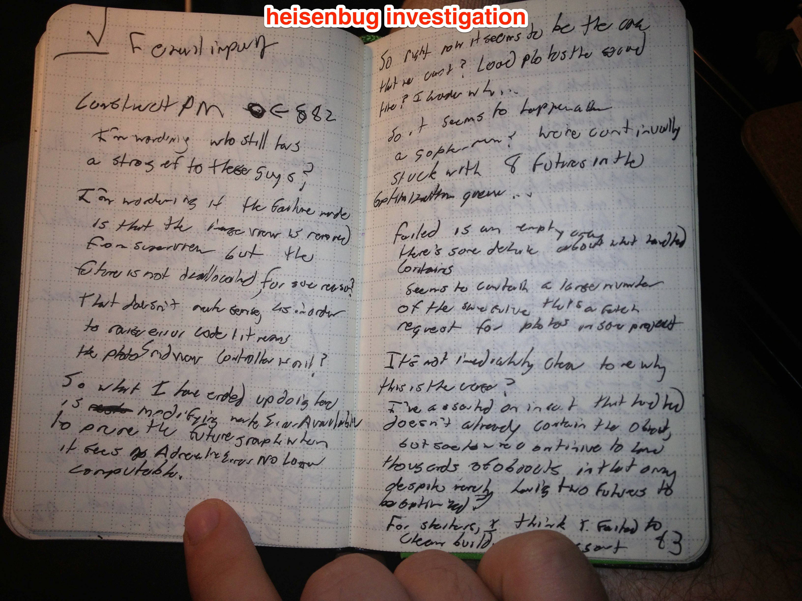

> I find one meeting can sometimes affect a whole day. A meeting commonly blows at least half a day, by breaking up a morning or afternoon. - Paul Graham

I find the best algorithm for dealing with interruptions is the same one computers use: the [journaling file system](http://en.wikipedia.org/wiki/Journaling_file_system).

The way it works is simple. When you want to do a disk operation, first, you write down in a special place (called a *journal*) what you are going to do, at a high level. "I'm going to delete this directory and all its files." Then, you go through the steps of actually doing that. Finally, you record in your journal that's what you did.

Now when power is interrupted during a disk operation you simply look at the journal and you can complete any operations that were in-flight at the time of the interruption. For example if the journal says "Delete X folder" and you see it still exists, now you delete it.  It's eventually consistent, even in the face of power interruptions, assuming that the intent hits the journal.  And since journaling a high-level operation is a lot faster than actually *doing* it, chances are you'll die doing the operation, not doing the journal.

The application to interruptible programming is straightforward. I have an actual paper journal and I will in a few words explain a task to the journal before I begin. 

I'll provide two examples.  When I'm investigating a *bug*, I usually work in a linear way, asking *questions* and getting *answer* (or *results*).  Then those *results* drive the next set of *questions*.

----

## get the unit tests to pass
* the unit test doesn't pass on OSX because postgres isn't running
    * start postgres
    * the unit test doesn't pass on Linux because the postgres credentials are wrong
        * refactor postgres credentials to work right on both platforms
    * one particular Linux machine still doesn't work
        * Is it 32-bit related?
            * No
        * Are we using the same compiler on that machine? `<--work marker`

----

You see here a moderately involved investigation into why a unit test doesn't pass.  This is the kind of thing that is hairy and will fall out of your head the moment the phone rings.  But simply by capturing my questions and the answers I uncover as they happen, I build a pageful of context that lets me jump in and out of the problem quickly.

The overhead of recording this information is microscopic, and the benefit of returning from every interruption to a page or so of context is awesome. It's almost better to be interrupted now, because I come back to a clearly defined problem--in this case checking the compiler on a particular machine--as opposed to starting on "blank slate" items with no direction.

The `<--work marker` is like the "current line" in a debugger--it tells you how far into this mess I've currently gone.  While for bugs this is usually at the end, there are other possibilities for features, as will become clear presently.

----

## Get SQL “update" statements to work
* Create security barrier views
    * Upgrade migration tools to preserve (intermingle) the order of tables and views
        * This is because security barrier views reference the tables they’re associated with, but some tables may reference security barrier views, causing a cyclical dependency
        * You could actually write a dependency solver to fix this, but given that it’s guaranteed to come out in a dependency-solved order from postgres dump, how about we just propagate that order, and save writing our own dependency solver for another day `<—work marker`
* Write query planner
    * Adapt “where” logic that we wrote for SELECT
* Handle optimistic locks
    * Make some decision about whether the rows should be versioned with numbers, GUIDs, or dates
    * Make some decision about whether relationships are versioned along with fundamental datatypes
* Write unit tests
    * Write test case for strings
    * Write test case for integers
    * Write security-related tests
        * Tests we expect to pass
        * Tests we expect to fail due to permissions issues
    * Write lock-related tests
* Punchlist
    * Turn off debug printing in schema generator
    * Document security implications
    * Re-enable all the tests, which I disabled for debugging purposes

----

Here you see a moderately complicated feature, the sort of thing that would take several days of solid, hard, work, and interruptions would be massive setbacks.  Yet by collecting a pageful or so of information contemporaneously I can snap back to being productive in a few minutes.

You also see that the `work marker` appears in the middle.  It represents that I have actually *implemented* all the things above it, and the things below it are still left to do.  

I write down ideas and tasks as they come to me, in whatever order seems sensible, but I implement in depth-first order.  (In such a way, I'm not interrupted, even by my own ideas.)  You'll notice that the things above the `work marker` are a lot more detailed than the things below it.  There are probably a lot more steps in writing a query planner than the one step I've listed, but by the time I get to it, I'll flesh them out.

You can also get fancy and use several markers to implement things out-of-order if you like; or you can use a checklist system.  Your call, really, but I tend to go with the marker system most of the time.

You'll also notice that above-the-marker I tend to document *decisions* and *rationales*, while below-the-marker I document *questions* or *things where a decision is required*.  Again, that will be refactored into recording decisions and rationales when I actually make them.

Finally, you'll notice that I have a *[punchlist](http://en.wikipedia.org/wiki/Punch_list)*.  This is a list of minor items that I broke while working on the feature proper.  For example, I may have turned on debug priting, or disabled some tests.  By recording that stuff here I ensure that I don't commit them that way.

# Commit messages

Finally, recording this information contemporaneously allows me to write pretty epic commit messages that include things like design rationales, complete histories of investigating the bug, and so on.  More information about that can be found in my [commit messages FAQ](/commit%20messages/).

# Why paper

Some people have asked me why I do this on paper, since typing it out with the computer you're using already is Obviously the Right Way.  I'm not religious about it, but it's simply that I haven't been able to stick with any electronic systems.

I work on a lot of projects, and the nature of my work is I switch between them frequently.  As such, it makes sense for me to index all development work across all projects in one place, rather than having to set up a Trello board or whatever for every new project I pick up.  While it's completely possible for me to set up One True Electronic Repository for All Devleopment Knowledge, it creates weird issues when you invite people and they get a lot of emails about projects they don't care about.  Whereas with a paper notebook, you just hand them the book, and at some point they give it back.  Or better yet, you don't, because nobody can read my shitty handwriting anyway, and that's a feature, not a bug.

Another reason I like paper is because the best note system, like the best camera, is the one you have with you.  No matter what the MBAs tell you, sometimes you have good bug theories off the clock, and you want to record them, but they don't make an OmniOutliner for iPhone, sorry.  They do, however, make pocket notebooks, and they're just as convenient to use in the grocery store as they are on your desk.  If you're looking for recommendations, I stand behind the [Leuchtturm1917 Pocket](http://www.amazon.com/Leuchtturm-Pocket-Notebook-Dots-LB14/dp/B002TSMGJ4/ref=sr_1_1?ie=UTF8&qid=1419886741&sr=8-1&keywords=leuchtturm+1917+pocket) and the [Rhodia Webnotebook](http://www.amazon.com/Rhodia-Black-Webnotebook-5-5x8-25-Grid/dp/B006CQSRDS/ref=sr_1_1?ie=UTF8&qid=1419886763&sr=8-1&keywords=rhodia+webnotebook).  Yes they are expensive and no, those are not affiliate links.  But you're a professional; don't skimp on important tools.

My notebooks also outlive any other system.  Startups come and go, but paper lasts until a housefire.  My grandkids will one day marvel at how shitty Python packaging was and how I spent 3 days fighting it.  I regularly see a notebook referenced in a commit message and pull up my thoughts while working on that commit, as fresh today as they were years ago.

Finally, you should have a paper notebook even if you don't use it for this.  Paper notebooks are like perma-bound scratch paper that you always have with you.  Just take all the things you did with scratch paper and do them in a notebook.  Writing down phone numbers.  Doing math.  Doodling in a boring meeting.  You have *no idea* how satisfying it is to whip out a notebook during an argument and say "But on March 24th, we decided *something else*," or to roll into the hardware store on a whim knowing that you carry the drawings for that home improvement project with you already.