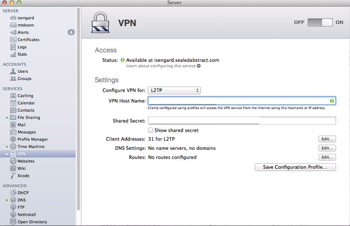
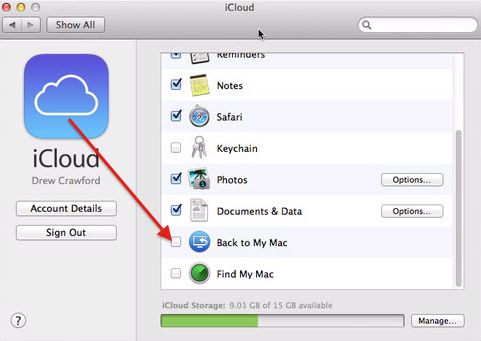
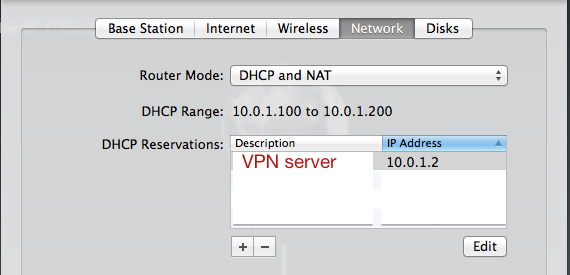
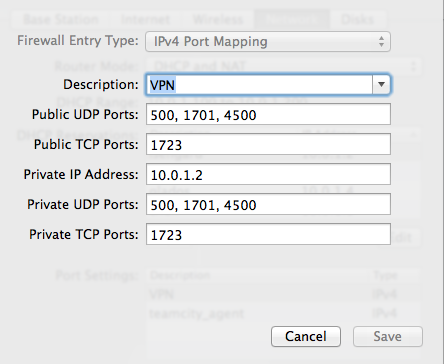
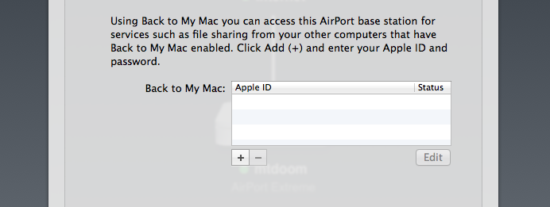
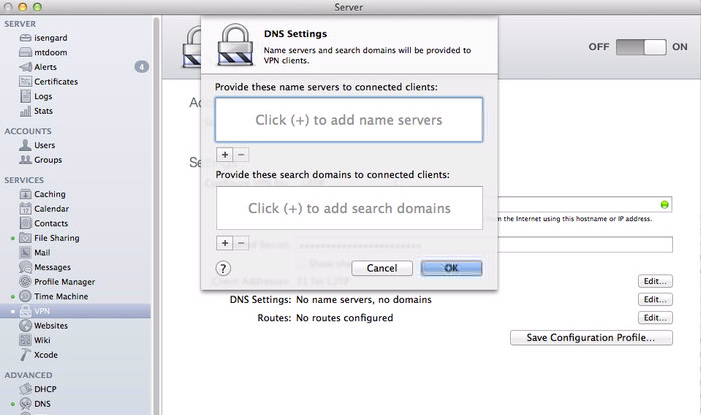
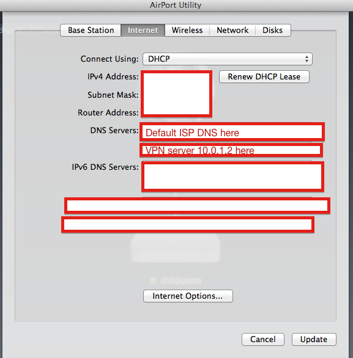

So, you want to set up a VPN.  Maybe you want to protect your traffic from rogue WiFi snoopers.  Maybe you want to access remote machines from behind a router (which, by the way, you can do very easily with IPv6, but you have to have v6 on both ends of the pipe.  I have it at home, but can't get it reliably elsewhere.)

VPNs have a reputation for being difficult to set up but it's pretty easy with OSX Server.

## Server config

Flip on the switch.  It turns out that is mostly what you have to do.  Some notes:

1.  Don't trust the shared key that Server.app pregenerates.  I had a weird problem where iOS clients (only) refused to connect.  The problem was resolved by generating my own preshared keys in a character set that was easier to type.
2.  Use a DynDNS service, or remember your external IP address.

Make sure Back to My Mac is disabled on the VPN server.  After you disable it, toggle the VPN server off and on again.

## Router config

It's probably a good idea to set up an IP reservation for our VPN server so it doesn't use DHCP.

Then we will forward UDP ports 500, 1701, 4500, and TPC port 1723.

If you have any Back to My Mac settings on your Airport, disable them:

At this point, you should be able to connect to the VPN from any Mac or iOS device.  Simply set

* Type to L2TP
* Shared Secret to the shared secret you chose when configuring the VPN.  Like I said earlier, you should change this, the default one is no good.
* Server Address to your server's domain name or external IP
* Account Name to the name of some account on the server.  Check Server.app's User page.
* Password to the password of that account

You should also be able to ping any computer on your network by IP.

## DNS the hard way

The problem is that over VPNs, mDNS (what you probably use to resolve names like mycomputer.local) doesn't work.  Also missing are things like Bonjour.

One way to solve this is to set up the VPN server as a DNS server.  This is actually pretty easy to do; just toggle it on under "Advanced" in Server.app and start creating "Machine records" that map hostnames like mygreatserver.drewsvpn to the IP reservations on the router.  It's important that they actually *match* the IP reservations on the router; we can't just have a bunch of dynamically-assigned IPs and expect our DNS settings to stay up to date.

You can even configure your VPN to automatically add the new DNS server to people's settings whenever they connect, so that everybody on the VPN can use the hostnames.  That is what the "DNS settings..." button on the VPN configuration page do.

The trouble starts when we want to make those hostnames visible not just to people on the VPN, but also people on the local network.  So you can use the same hostnames both when you're local and when you're remote.  This is a convenient setup for using Xcode Server, for example.

You might naively imagine that you could get away with inserting your DNS server somewhere in the list on your router.  Here, for example:

Sadly, however, due to a strange quirk of the Airport firmware, this [breaks the guest network](http://support.apple.com/kb/TS4505).  It makes some amount of sense, due to one of the DNSes existing on the non-guest network, that it would be unreachable to guests.  What's more puzzling is that all DNS is unreachable as long as any "main network" IP address appears in the DNS list.  Surely the point of having more than one is to fallback if one is unreachable?  But anyway.

## DNS the easy way

What I do instead is simple, and sort of cheating.  I buy a domain name, let's call it myvpn.com.

Then, I simply create real, publicly-visible DNS records from computer1.myvpn.com to a private IP like 10.0.1.2.  These records are completely useless to the internet at large, because the IPs are all in private blocks.  But anyone on my network or my VPN can use these hostnames to connect to computers on the network.  And the same domain names work in all places.

