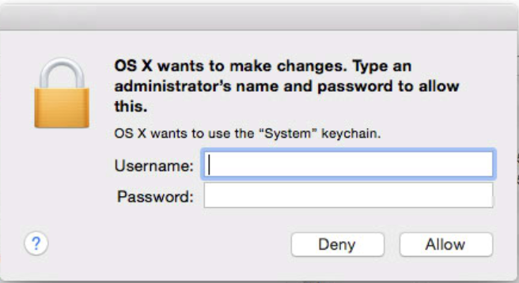
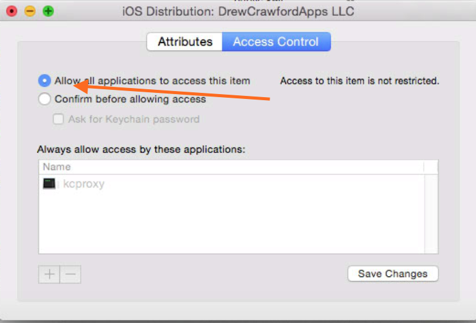
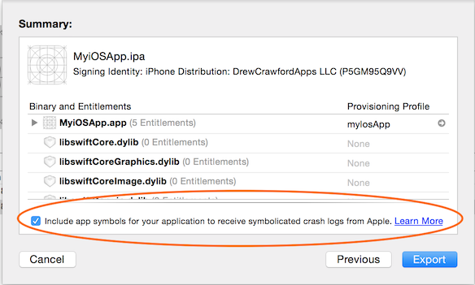

# Triggers

Triggers run under a user called `_xcsbuildd`.

In XC6b5, the following environment variables are available to triggers.

Pre-build:

```bash
XCS=1
XCS_BOT_NAME=DCAKit Bot
XCS_SOURCE_DIR=/Library/Developer/XcodeServer/Integrations/Caches/5fa0beca97c1a3e60628eee97e0850cd/Source
SHELL=/bin/false
XCS_INTEGRATION_RESULT=unknown
TMPDIR=/var/folders/5k/p7z1tq3j7k506xfjydcj_nh8000086/T/
Apple_PubSub_Socket_Render=/private/tmp/com.apple.launchd.QAa4hWMKNZ/Render
XCS_BOT_TINY_ID=CC18F5D
XCS_INTEGRATION_ID=5fa0beca97c1a3e60628eee97e0876a0
USER=_xcsbuildd
XCS_INTEGRATION_TINY_ID=8CC9408
SSH_AUTH_SOCK=/private/tmp/com.apple.launchd.vBUQutpe1W/Listeners
__CF_USER_TEXT_ENCODING=0x106:0x0:0x0
PATH=/Applications/Xcode6-Beta5.app/Contents/Developer/usr/bin:/usr/bin:/bin:/usr/sbin:/sbin
XCS_BOT_ID=5fa0beca97c1a3e60628eee97e0850cd
PWD=/Library/Developer/XcodeServer/Integrations/Caches/5fa0beca97c1a3e60628eee97e0850cd/Source
XPC_FLAGS=0x0
XPC_SERVICE_NAME=0
SHLVL=1
HOME=/var/_xcsbuildd
LOGNAME=_xcsbuildd
XCS_OUTPUT_DIR=/Library/Developer/XcodeServer/Integrations/Integration-5fa0beca97c1a3e60628eee97e0876a0
XCS_INTEGRATION_NUMBER=1
_=/usr/bin/env
```

Post-build:

```bash
XCS=1
XCS_BOT_NAME=DCAKit Bot
XCS_SOURCE_DIR=/Library/Developer/XcodeServer/Integrations/Caches/5fa0beca97c1a3e60628eee97e0850cd/Source
SHELL=/bin/false
XCS_WARNING_CHANGE=-1
XCS_INTEGRATION_RESULT=build-errors
TMPDIR=/var/folders/5k/p7z1tq3j7k506xfjydcj_nh8000086/T/
Apple_PubSub_Socket_Render=/private/tmp/com.apple.launchd.QAa4hWMKNZ/Render
XCS_TEST_FAILURE_COUNT=0
XCS_BOT_TINY_ID=CC18F5D
XCS_INTEGRATION_ID=5fa0beca97c1a3e60628eee97e0941a2
USER=_xcsbuildd
XCS_TEST_FAILURE_CHANGE=0
XCS_INTEGRATION_TINY_ID=401BFB0
SSH_AUTH_SOCK=/private/tmp/com.apple.launchd.vBUQutpe1W/Listeners
__CF_USER_TEXT_ENCODING=0x106:0x0:0x0
PATH=/Applications/Xcode6-Beta5.app/Contents/Developer/usr/bin:/usr/bin:/bin:/usr/sbin:/sbin
XCS_BOT_ID=5fa0beca97c1a3e60628eee97e0850cd
PWD=/Library/Developer/XcodeServer/Integrations/Caches/5fa0beca97c1a3e60628eee97e0850cd/Source
XCS_XCODEBUILD_LOG=/Library/Developer/XcodeServer/Integrations/Integration-5fa0beca97c1a3e60628eee97e0941a2/build.log
XPC_FLAGS=0x0
XCS_ERROR_COUNT=1
XCS_ANALYZER_WARNING_COUNT=0
XCS_TESTS_CHANGE=0
XPC_SERVICE_NAME=0
XCS_ERROR_CHANGE=0
SHLVL=1
HOME=/var/_xcsbuildd
XCS_ANALYZER_WARNING_CHANGE=0
LOGNAME=_xcsbuildd
XCS_WARNING_COUNT=7
XCS_TESTS_COUNT=0
XCS_OUTPUT_DIR=/Library/Developer/XcodeServer/Integrations/Integration-5fa0beca97c1a3e60628eee97e0941a2
XCS_INTEGRATION_NUMBER=2
_=/usr/bin/env
```

If an archive was produced, you'll also get

```bash
XCS_ARCHIVE=/Library/Developer/XcodeServer/Integrations/Integration-5fa0beca97c1a3e60628eee97e10a69b/Archive.xcarchive
```

If a product was produced (puzzlingly, an archive doesn't necessarily indicate a product), you'll also get

```bash
XCS_PRODUCT=HockeyAppTester2 Bot.ipa
```

which happens to be located in XCS_OUTPUT_DIR directory, aparrently.  


## Figuring out build status

`XCS_INTEGRATION_RESULT`'s known values are

* `unknown`, build in progress
* `build-errors`, failed to build
* `warnings`, warnings ocurred
* `analyzer-warnings`, analyze results occurred
* `test-failures`, tests failed
* `succeeded`, everything was fine

You get exactly one of these, it's not quite clear what the priority is when multiple are possible.

## Reporting status to GitHub

Try [CaveJohnson](http://github.com/drewcrawford/CaveJohnson)

## Uploading stuff to TestFlight

Try [CaveJohnson](http://github.com/drewcrawford/CaveJohnson)

# Signing for *distribution*

So funny story.  XCS only works for development certificates, officially.  Unofficially, you can make it work with distribution certificates.  This is important if you want to do, e.g., TestFlight.

The profile is simple.  Just copy to `/Library/Developer/XcodeServer/ProvisioningProfiles/`.  [CaveJohnson](http://github.com/drewcrawford/CaveJohnson) can do this automatically.

Then you move the distribution certificate into the *system* keychain.

Perhaps less obviously, the provisioning profile must be manually set (can't set to Automatic in build settings).  If you leave it on Automatic, you'll get Developer certificates, even if you've set "iPhone Distribution: Automatic" under codesigning.

Even less obviously, doing *that* causes a hang in swift-lib-tool ("copying Swift Standard Libraries...").  This is because it's trying to display this security dialog:



Even though it can't since Xcode Server obviously doesn't have an interactive logon session.  So the process just *hangs*, waiting for you to type in a password in an invisible dialog.

The solution is to tick the radio box that prevents displaying this dialog:



# The case of the missing SwiftSupport

You may get some kind of email like this from iTunesConnect:

> Invalid Swift Support - The bundle contains an invalid implementation of Swift. The app may have been built or signed with non-compliant or pre-release tools. Visit developer.apple.com for more information.


This is because the IPA that Xcode Server built doesn't have a `SwiftSupport` folder, even though the .xcarchive does.

The answer is to build your own IPA including the `SwiftSupport` from the xcarchive.  [CaveJohnson](http://github.com/drewcrawford/CaveJohnson) does this with its `xcodeGUITricks` command.  I've filed rdar://19432441 for this issue.

# Create .symbol files with this one weird trick


iTunesConnect symbolification uses a new file format called `.symbol` (unlike all the third-party services, which use `dSYM`).

Again, this is only generated by the Xcode GUI and so only the GUI, and not Xcode Server nor `xcodebuild` knows how to do it.



Until now.  It turns out that this is done via a command like

```
/Applications/Xcode.app/Contents/Developer/usr/bin/symbols -noTextInSOD -noDaemon -arch all -symbolsPackageDir /Symbols appbinary
```

Again, [CaveJohnson](http://github.com/drewcrawford/CaveJohnson) can generate these symbols on the CLI with its `xcodeGUITricks` command.
